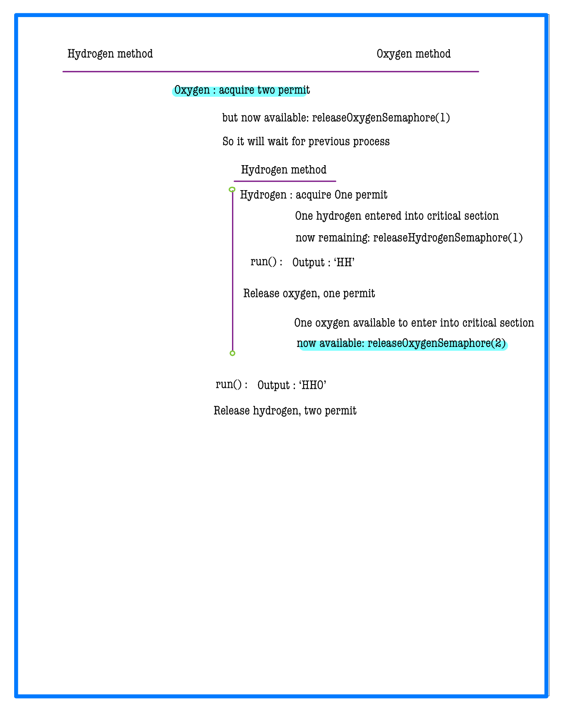
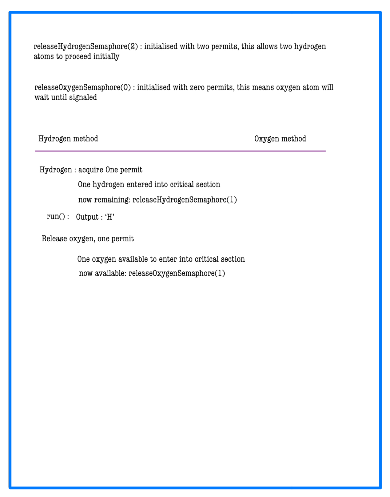

# Concurrency Problem - Building H2O (Solved)

Get your doubts resolved quickly with Chat GPT Help  
**Check Chat GPT**  
Using hints instead of Complete Solution is now penalty-free.

---

## Problem Statement

There are two kinds of threads: `oxygen` and `hydrogen`. Your goal is to coordinate these threads to form water molecules (`H₂O`).

- **Threads involved:** `oxygen` and `hydrogen`.
- **Synchronization point:** A barrier where each thread must wait until a complete molecule (3 threads: 1 oxygen + 2 hydrogen) can be formed.
- **Methods available:** `releaseHydrogen()` and `releaseOxygen()` which allow threads to pass the barrier.

### Constraints:
- Threads should pass in groups of three: one oxygen and two hydrogens, bonded immediately to form water.
- All threads of one molecule must bond before others start bonding.
- Arrival conditions:
    - If an oxygen thread arrives with no hydrogen threads, it must wait for 2 hydrogen threads.
    - If a hydrogen thread arrives with no other threads, it must wait for an oxygen thread and another hydrogen thread.
- The sequence of threads that bond should be divided into valid groups of `(O, H, H)`.

---

## Example 1
```plaintext
Input: water = "HOH"
Output: "HHO"
Explanation: All permutations like "HOH" and "OHH" are valid.
```

## Example 2
```plaintext
Input: water = "OOHHHH"
Output: "HHOHHO"
Explanation: "HOHHHO", "OHHHHO", "HHOHOH", "HOHHOH", "OHHHOH", "HHOOHH", "HOHOHH" and "OHHOHH" are also valid answers.
```

# 📝 Problem Solutions
---
### Approach1 :
#### Source code : [ConcurrencyProblemsBuildingH2O.originalQuestion.java](../../../../../../../lowLevelDesignModuleOne.QuestionAnswer.synchronizationwithSemaphores.assignment.ConcurrencyProblemsBuildingH2O.originalQuestion.java)
#### Time Complexity : o(qn)
#### Space Complexity : o(1)

 

