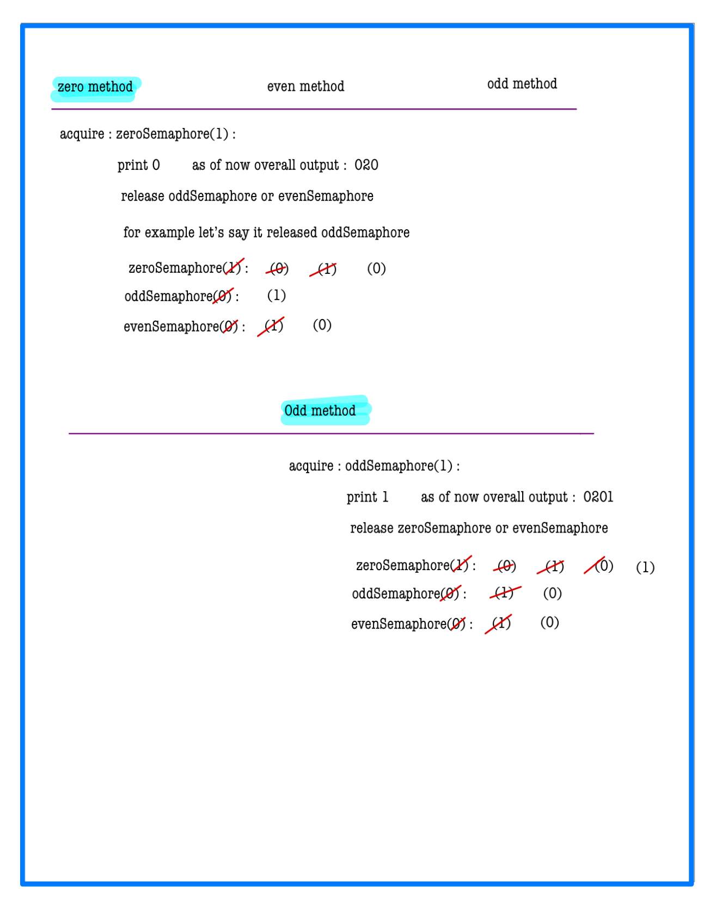
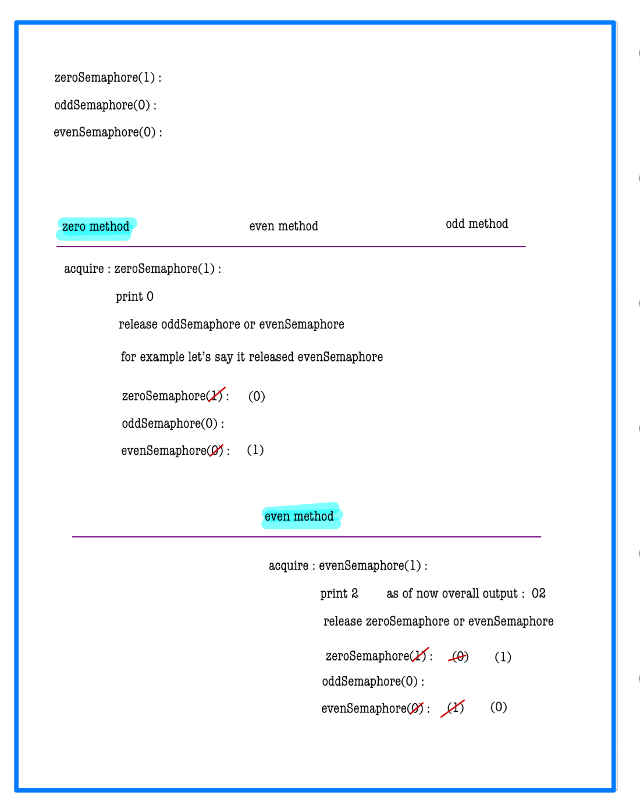

# Concurrency Problems - Print Zero Even Odd

You have an object `printNumber`. `printNumber.accept(x)` can be called with an integer parameter that prints it to the console.

You are given an instance of the class `ZeroEvenOdd` that has three functions: `zero()`, `even()`, and `odd()`. The same instance of `ZeroEvenOdd` will be passed to three different threads:
- **Thread A**: calls `zero()` that should only output zeros (`0`).
- **Thread B**: calls `even()` that should only output even numbers.
- **Thread C**: calls `odd()` that should only output odd numbers.

Modify the given class to output the series "`0102030405...`" where the length of the series must be `2 * n`.

## Implementation Details

Implement the `ZeroEvenOdd` class with the following functions:
- `ZeroEvenOdd(int n)`  
  Initializes the object with the number `n` that represents the numbers that should be printed.
- `void zero(printNumber)`  
  Calls `printNumber` to output one zero.
- `void even(printNumber)`  
  Calls `printNumber` to output one even number.
- `void odd(printNumber)`  
  Calls `printNumber` to output one odd number.

## Constraints

- `1 <= n <= 1000`

---

## Example Usage

```
# For n = 2, expected output: "0102"
# For n = 5, expected output: "0102030405"
```

# 📝 Problem Solutions
---
### Approach:
#### Source code : [ConcurrencyProblemsPrintZeroEvenOdd.java](../../../../../../lowLevelDesignModuleOne/QuestionAnswer/synchronizationwithSemaphores/assignment/ConcurrencyProblemsPrintZeroEvenOdd/originalQuestion/ConcurrencyProblemsPrintZeroEvenOdd.java)




---

### Similar Questions
#### Question 1: : [ConcurrencyProblemAmusementParkRide](../similarQuestion/ConcurrencyProblemAmusementParkRide/ConcurrencyProblemAmusementParkRide.md)

#### Question 2: : [ConcurrencyProblemAssemblingRobots](../similarQuestion/ConcurrencyProblemAssemblingRobots/ConcurrencyProblemAssemblingRobots.md)

#### Question 3: : [ConcurrencyProblemDNASequencing](../similarQuestion/ConcurrencyProblemDNASequencing/ConcurrencyProblemDNASequencing.md)

#### Question 4: : [ConcurrencyProblemMoleculeAssembly](../similarQuestion/ConcurrencyProblemMoleculeAssembly/ConcurrencyProblemMoleculeAssembly.md)

#### Question 5: : [ConcurrencyProblemNuclearReactorControl](../similarQuestion/ConcurrencyProblemNuclearReactorControl/ConcurrencyProblemNuclearReactorControl.md)

#### Question 6: : [ConcurrencyProblemPizzaAssemblyLine](../similarQuestion/ConcurrencyProblemPizzaAssemblyLine/ConcurrencyProblemPizzaAssemblyLine.md)

#### Question 7: : [ConcurrencyProblemSpaceStationAirlock](../similarQuestion/ConcurrencyProblemSpaceStationAirlock/ConcurrencyProblemSpaceStationAirlock.md)

#### Question 8: : [ConcurrencyProblemTrafficLightIntersection](../similarQuestion/ConcurrencyProblemTrafficLightIntersection/ConcurrencyProblemTrafficLightIntersection.md)

#### Question 9: : [ConcurrencyProblemBalancedDietMealPlanner](../similarQuestion/ConcurrencyProblemBalancedDietMealPlanner/ConcurrencyProblemBalancedDietMealPlanner.md)

#### Question 10: : [ConcurrencyProblemMusicalQuartetCoordinator](../similarQuestion/ConcurrencyProblemMusicalQuartetCoordinator/ConcurrencyProblemMusicalQuartetCoordinator.md)


